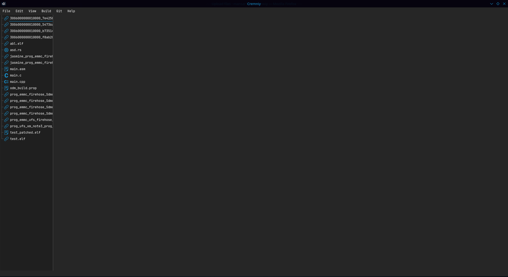
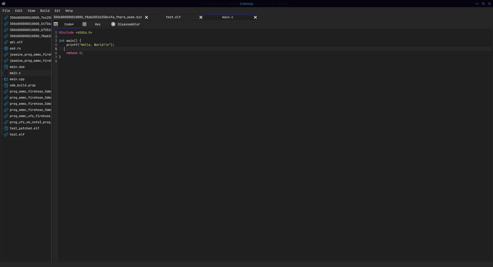
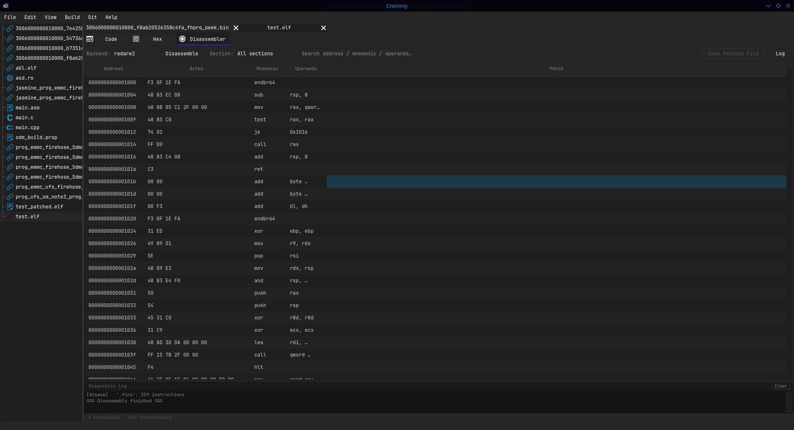
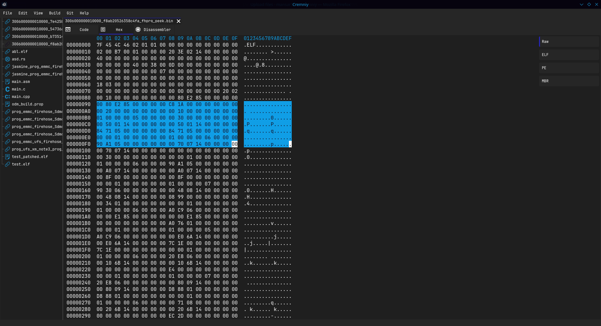

<div align="center">


<br>
<h3>Cremniy</h3>
<h6>A development environment for low-level programming that combines all low-level tools into a single application</h6>

[](LICENSE)
[](CONTRIBUTING.md)
[](https://t.me/cremniy_com)
<br>
[](https://en.cppreference.com/w/cpp/17)
[](https://www.qt.io/)

English • [Русский](README_ru.md)

</div>

---

## What is Cremniy?

**Cremniy** is an integrated environment for low-level development. Instead of juggling a hex editor here, a disassembler there, and a code editor somewhere else — you get them all in one consistent, focused application.

**Built for:**

- 🛠 System software developers
- 🔍 Reverse engineers
- 🔐 Information security specialists
- 📡 Embedded systems developers

---

## Screenshots

<div align="center">

**Main Menu**


<br><br>

**Code Editor**


<br><br>

**Disassembler**


<br><br>

**HEX Editor**


</div>

---

## Features

### Available now

| Feature | Description |
|---|---|
| 📝 Code editor | Write and edit low-level code with syntax support |
| 🔢 HEX editor | Inspect and modify binary data at the byte level |
| 🔧 Disassembler | Decode machine instructions into readable assembly |

### Coming soon

- 🐛 **Debugger** — step through execution, inspect registers and memory
- 🧠 **Memory visualization** — visual maps of memory layout and allocation

---

## Getting Started

### Prerequisites

| Dependency | Minimum version |
|---|---|
| **CMake** | 3.16 |
| **Qt** | 6.x |
| **C++ compiler** | C++17 support |

<details>
<summary><b>🪟 Windows</b></summary>

1. Install [Qt 6](https://www.qt.io/download-qt-installer-oss) — select the **Qt Widgets** component during setup.
2. Install [CMake](https://cmake.org/download/) (≥ 3.16), or use the version bundled with Qt.
3. Install a C++17-compatible compiler:
   - [Visual Studio 2019+](https://visualstudio.microsoft.com/) (MSVC) — select the **"Desktop development with C++"** workload.
   - Or [MinGW-w64](https://www.mingw-w64.org/).

> [!TIP]
> If using Visual Studio, make sure the **"Desktop development with C++"** workload is checked during installation.

</details>

<details>
<summary><b>🐧 Linux (Ubuntu / Debian)</b></summary>

```bash
sudo apt update
sudo apt install cmake g++ qt6-base-dev
```

> [!NOTE]
> If `qt6-base-dev` is unavailable in your distribution's repositories, use the [official Qt installer](https://www.qt.io/download-qt-installer-oss) instead.

</details>

<details>
<summary><b>🍎 macOS</b></summary>

Using [Homebrew](https://brew.sh/):

```bash
brew install cmake qt@6
```

</details>

---

## Building

### Clone and build

```bash
git clone https://github.com/igmunv/cremniy.git
cd cremniy

mkdir build && cd build
cmake ../src
cmake --build .
```

### Release build

```bash
cmake ../src -DCMAKE_BUILD_TYPE=Release
cmake --build . --config Release
```

---

## Contributing

Contributions are **welcome and encouraged**.

Whether it's a bug fix, a new feature, or an improvement to documentation — feel free to open an issue or submit a pull request.

All contributors are credited in [ACKNOWLEDGEMENTS.md](ACKNOWLEDGEMENTS.md) and mentioned in videos on the [YouTube channel](https://www.youtube.com/@igmunv).

For guidelines, see [CONTRIBUTING.md](CONTRIBUTING.md).

---

## License

Distributed under the terms described in [LICENSE](LICENSE).
